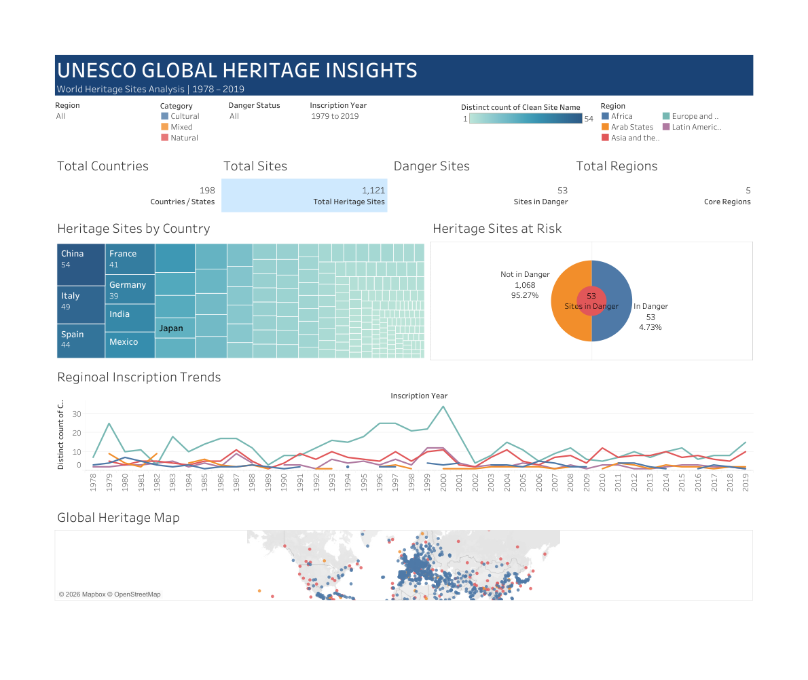

# 🌍 UNESCO Global Heritage Insights

An interactive **Data Analytics** project developed using **Tableau** and **Python Flask** to analyze UNESCO World Heritage Sites across the globe. The project transforms raw UNESCO heritage data into meaningful visual insights through interactive dashboards, KPI cards, maps, and trend analysis.

---

## 📌 Project Overview

UNESCO World Heritage Sites are globally recognized cultural, natural, and mixed heritage locations. This project analyzes **1,121 heritage sites** across **198 countries/states** to identify global heritage distribution, endangered sites, inscription trends, and geographical patterns.

The analytics are developed in **Tableau**, while a **Flask web application** provides a clean interface for presenting the dashboard.

---

## 🎯 Objectives

- Analyze UNESCO Heritage Sites by Country/State
- Identify Heritage Sites at Risk
- Study Regional Inscription Trends (1978–2019)
- Visualize Global Heritage Distribution
- Build Interactive Tableau Dashboards
- Present Results using a Flask Web Application

---

# 📊 Dashboard KPIs

| KPI | Value |
|------|-------|
| Total Heritage Sites | **1,121** |
| Countries / States | **198** |
| Sites in Danger | **53** |
| Core Regions | **5** |

---

# 📈 Dashboard Visualizations

- ✅ KPI Cards
- ✅ Heritage Sites by Country (Treemap)
- ✅ Heritage Sites at Risk (Donut Chart)
- ✅ Regional Inscription Trends (Line Chart)
- ✅ Global Heritage Map
- ✅ Interactive Filters
- ✅ Story Presentation

---

# 🛠 Technology Stack

| Technology | Purpose |
|------------|---------|
| Tableau | Data Visualization |
| Python | Backend |
| Flask | Web Application |
| HTML5 | Frontend Structure |
| CSS3 | Styling |
| CSV Dataset | Data Source |
| Git & GitHub | Version Control |

---

# 📂 Project Structure

```text
UNESCO-Global-Heritage-Insights
│
├── static
│   ├── css
│   │      style.css
│   │
│   └── images
│          unesco_dashboard.png
│
├── templates
│      base.html
│      index.html
│      embed.html
│      about.html
│
├── app.py
├── requirements.txt
├── README.md
├── .gitignore
└── UNESCO_Heritage_Project_Documentation.pdf
```

---

# ⚙️ Project Workflow

```text
UNESCO CSV Dataset
        │
        ▼
Data Cleaning & Preparation
        │
        ▼
Tableau Data Connection
        │
        ▼
Calculated Fields & KPIs
        │
        ▼
Worksheets
        │
        ▼
Dashboard
        │
        ▼
Story
        │
        ▼
Flask Web Application
        │
        ▼
End User
```

---

# 🚀 Features

- Professional Dashboard Design
- Interactive Tableau Analytics
- Heritage Risk Analysis
- Regional Trend Analysis
- Country-wise Heritage Distribution
- Geographic Visualization
- Responsive Flask Frontend
- Dashboard Integration
- GitHub Version Control

---

# 📸 Screenshots

## 🏠 Home Page

_Add your Home Page screenshot here._

```
static/images/home.png
```

---

## 📊 Dashboard

_Add your Dashboard screenshot here._

```
static/images/unesco_dashboard.png
```

---

# ▶️ Installation

Clone the repository

```bash
git clone https://github.com/yourusername/UNESCO-Global-Heritage-Insights.git
```

Navigate into the project

```bash
cd UNESCO-Global-Heritage-Insights
```

Create a virtual environment

```bash
python -m venv venv
```

Activate the virtual environment

Windows

```bash
venv\Scripts\activate
```

Install dependencies

```bash
pip install -r requirements.txt
```

Run the application

```bash
python app.py
```

Open in browser

```
http://127.0.0.1:5000
```

---

# 📊 Analytical Insights

The dashboard helps answer questions such as:

- Which countries have the highest number of UNESCO Heritage Sites?
- How many heritage sites are currently endangered?
- Which regions have experienced the highest inscription growth?
- How are heritage sites distributed globally?
- What are the historical trends of UNESCO site inscriptions?

---

# 📄 Documentation

Complete project documentation is included in:

```
UNESCO_Heritage_Project_Documentation.pdf
```

---

# 🔮 Future Enhancements

- Publish Dashboard on Tableau Public
- Live Dashboard Integration
- Search Functionality
- Region-wise Drill Down
- Country Comparison
- Mobile Responsive Dashboard
- User Authentication
- Database Integration

---

# 👨‍💻 Author

**Sai Pavan**

Data Analytics Intern

---

# ⭐ If you found this project useful, consider giving it a Star!

## 🏠 Home Page


## 📊 Dashboard

